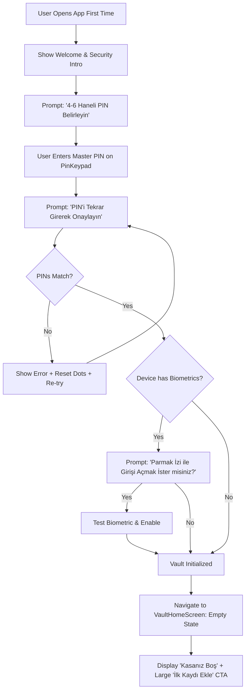
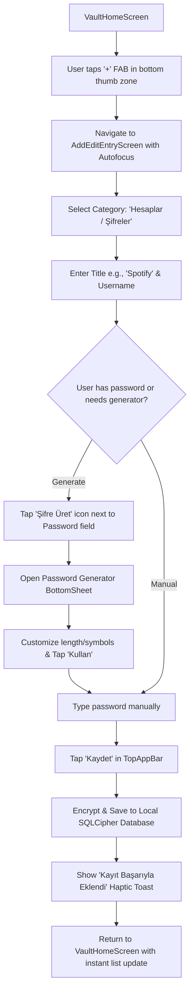
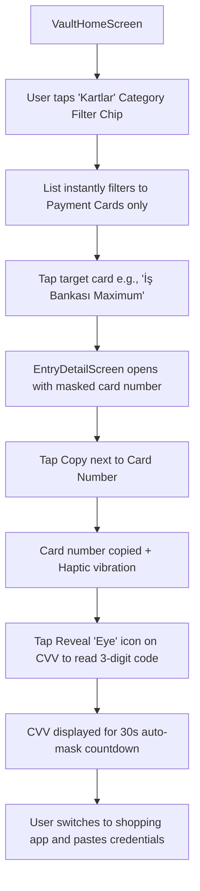
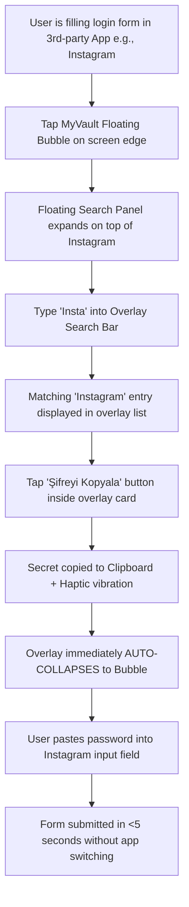
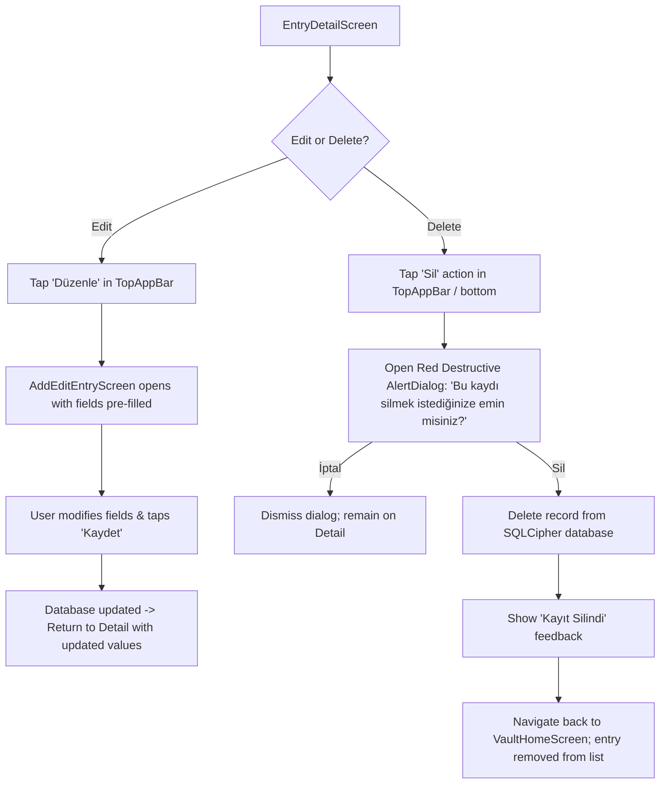

# MyVault — Core User Flows & Journeys

## FLOW A: Initial Setup & Vault Initialization



---

## FLOW B: Adding a New Password / Account



---

## FLOW C: Finding a Record & Copying (In-App Search)

```mermaid
graph TD
    A[VaultHomeScreen] --> B[User taps Search Bar at top of canvas]
    B --> C[User types query e.g., 'Garanti']
    C --> D[In-memory filter updates in <16ms on every keystroke]
    D --> E[Matching EntryCards rendered in viewport]
    E --> F{Direct copy or full view?}
    F -- Direct Quick Copy --> G[Tap Copy button directly on EntryCard]
    G --> H[Plaintext secret copied to Android Clipboard]
    H --> I[Haptic vibration + 'Şifre panoya kopyalandı' feedback]
    F -- Full Detail View --> J[Tap EntryCard body]
    J --> K[Open EntryDetailScreen showing all fields]
    K --> L[Tap Copy next to specific field (Username/Password/Notes)]
    L --> H
```

---

## FLOW D: Checkout / Card Usage Flow



---

## FLOW E: Floating Overlay Usage (Zero-Context-Switch Flow)



---

## FLOW F: Return from Background & Re-Authentication

```mermaid
graph TD
    A[App placed in background by user] --> B[Background Lock Timer starts]
    B --> C[User re-opens MyVault from Recent Apps]
    C --> D{Timeout elapsed / Lock enabled?}
    D -- No --> E[Resume current screen immediately]
    D -- Yes --> F[Display AuthLockScreen covering all data (FLAG_SECURE active)]
    F --> G{Biometrics enabled & hardware available?}
    G -- Yes --> H[Auto-trigger BiometricPrompt]
    H -- Success --> I[Unlock Vault -> Navigate to VaultHomeScreen]
    H -- Cancel / Fail --> J[Fall back to PinKeypad on screen]
    G -- No --> J
    J --> K[User types 4-6 digit Master PIN]
    K -- Verified --> I
    K -- Wrong PIN --> L[Shake dots + Warning haptic + Retry]
    L --> J
```

---

## FLOW G: Editing & Destructive Deletion


